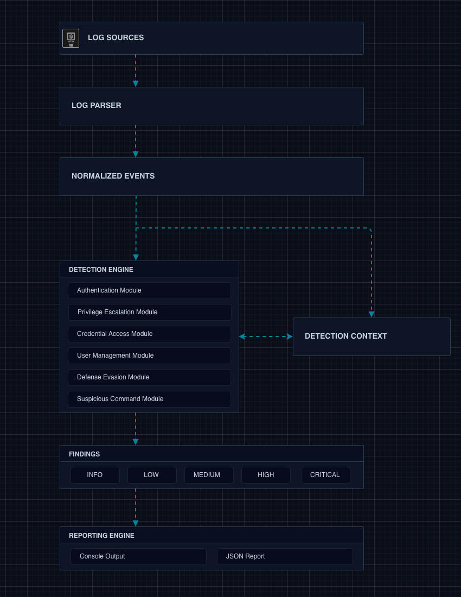

# Mini SIEM

A lightweight Python-based Security Information and Event Management (SIEM) platform designed to analyze Linux system logs, identify suspicious activity, and generate actionable security findings.

This project focuses on core detection engineering concepts, including log parsing, event correlation, threat detection, and security reporting.

---

## Key Features

* Parse Linux system logs
* Normalize security events
* Detect common security events and suspicious activity
* Correlate related events
* Generate structured findings
* Export JSON reports

---
## About This Project

Mini SIEM was developed to explore detection engineering concepts commonly used in Security Operations Centers (SOCs). The project focuses on transforming Linux log data into normalized events, applying security detections, and generating structured findings suitable for further analysis and reporting.

---

## Architecture



---

## Detection Workflow
```text
Log Sources
 ↓
Log Parser
 ↓
Normalized Events
 ↓
Detection Modules
 ↓
Findings
 ↓
Reports
```

---

## Supported Log Sources

| Source | Status |
|----------|----------|
| auth.log | Supported |
| syslog | Supported |
| Custom Test Logs | Supported |

---

## Project Structure

```text
mini-siem/
├── src/
│   ├── linuxMiniSIEM.py
│   └── SIEM_CLASSES/
│       ├── SIEMDetectionEngine.py
│       ├── SIEMLogParser.py
│       ├── StandardizedDataStructures.py
│       └── DETECTORS/
│           ├── __init__.py
│           ├── DetectorBaseDefinition.py
│           ├── AuthenticationEvents.py
│           ├── CredentialAccessEvents.py
│           ├── DefenseEvasionEvents.py
│           ├── PrivilegeEscalationEvents.py
│           ├── SuspiciousCommandEvents.py
│           └── UserManagementEvents.py
├── docs/
│   └── detection-matrix.md
├── examples/
│   ├── benign_auth.log
│   ├── compromised_host.log
│   ├── detection_validation.log
│   ├── insider_activity.log
│   └── sample_auth.log
├── reports/
├── screenshots/
├── tests/
├── requirements.txt
└── README.md
```

---

## Detection Coverage

### Authentication Events

| Detection                       | Severity | Reason                                       |
| ------------------------------- | -------- | -------------------------------------------- |
| Invalid User Login              | LOW      | Reconnaissance                               |
| Failed Login                    | INFO     | Common event, primarily used for correlation |
| SSH Brute Force                 | HIGH     | Active attack                                |
| Successful Login                | INFO     | Normal event, primarily used for correlation |
| Successful Login After Failures | CRITICAL | Potential compromise                         |
| Root Login Success              | CRITICAL | High-value account access                    |

### User Management Events

| Detection        | Severity | Reason                              |
| ---------------- | -------- | ----------------------------------- |
| User Created     | MEDIUM   | Administrative change / persistence |
| User Deleted     | MEDIUM   | Account manipulation                |
| Password Changed | MEDIUM   | Account manipulation                |

### Privilege Escalation Events

| Detection                 | Severity | Reason               |
| ------------------------- | -------- | -------------------- |
| User Added To sudo Group  | HIGH     | Privilege escalation |
| User Added To wheel Group | HIGH     | Privilege escalation |

### Credential Access Events

| Detection          | Severity | Reason                              |
| ------------------ | -------- | ----------------------------------- |
| Shadow File Access | HIGH     | Credential access                   |
| Passwd File Access | LOW      | Usually public, but worth recording |

### Defence Evasion Events

| Detection        | Severity | Reason                            |
| ---------------- | -------- | --------------------------------- |
| Auditd Stopped   | HIGH     | Disables auditing                 |
| Firewall Stopped | HIGH     | Reduces host protection           |
| Telnet Enabled   | HIGH     | Introduces insecure remote access |

### Suspicious Commands Events

| Detection           | Severity | Reason                                              |
| ------------------- | -------- | --------------------------------------------------- |
| Nmap Installation   | MEDIUM   | Legitimate admin tool but useful for reconnaissance |
| TAR Archive Creation| MEDIUM   | Legitimate admin tool but useful for data staging   |
| Netcat Installation | HIGH     | Common attacker tooling                             |
| SCP File Transfer   | HIGH     | Potential data exfiltration                         |
| Curl Download       | HIGH     | Potential payload retrieval                         |
| Wget Download       | HIGH     | Potential payload retrieval                         |


---

## Detection Statistics

Current detection coverage includes:

- 3 Authentication detections
- 3 User Management detections
- 2 Privilege Escalation detections
- 2 Credential Access detections
- 3 Defense Evasion detections
- 6 Suspicious Command detections

Total: 19 detection rules

---

## Example Normalized Event

```json
{
    "entry_type": "AUTHENTICATION",
    "entry_class": "AUTHENTICATION",
    "entry_subclass": "FAILED_LOGIN",
    "entry_timestamp": "2026-06-20T08:10:01",
    "source_ip": "203.0.113.50",
    "associated_username": "root"
}
```

---

## Example Finding

```json
{
    "severity_level": "CRITICAL",
    "detected_finding": "SUCCESSFUL_LOGIN",
    "finding_description": "Root Login Success after [ 4 ] Failures",
    "timestamp": "2026-06-20T08:10:11",
    "privilege_level": "Non-Elevated",
    "source_ip": "203.0.113.50",
    "associated_username": "root",
    "event_count": 4,
    "additional_details": null
}
```

---

## Technologies

* Python 3
* Linux
* JSON
* Regular Expressions

---

## Documentation

- [Detection Matrix](docs/detection-matrix.md)
- Example Log Files (`examples/`)
 
---

## Future Enhancements

- MITRE ATT&CK mapping
- Sigma-style detection rules
- Additional Linux log source support
- Expanded event correlation capabilities

---

## License

MIT License

